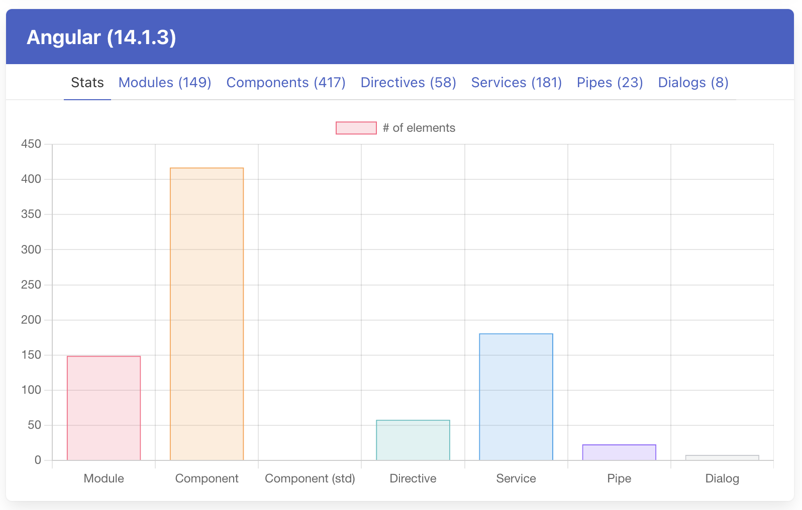
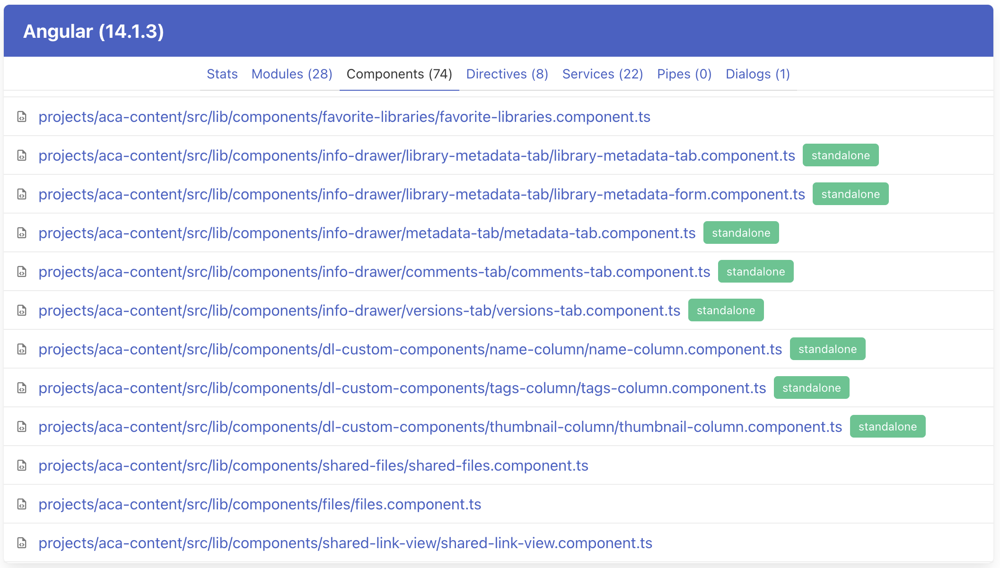
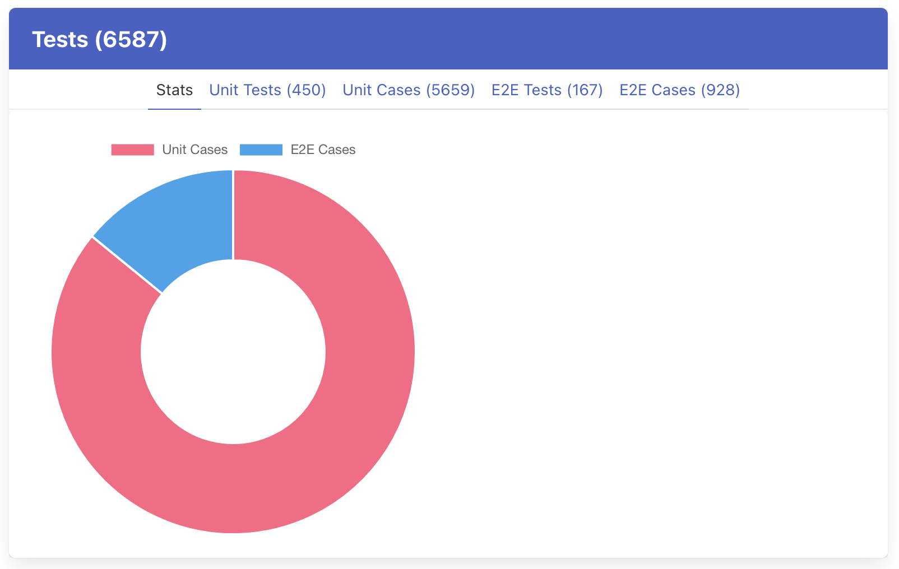
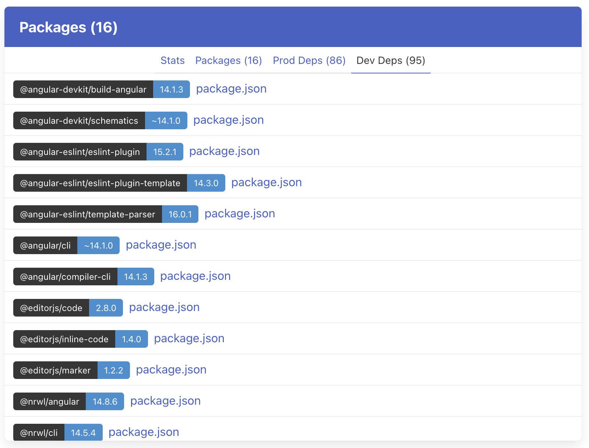
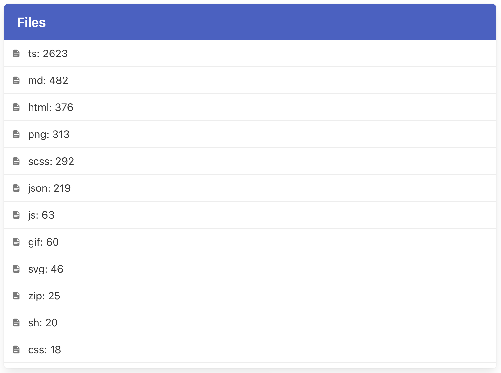

# BirdView

Command-line utilities to gather statistics for the Angular projects.

## Installing

Install Rust and Cargo  
https://doc.rust-lang.org/cargo/getting-started/installation.html

```shell
# with Cargo
cargo install birdview

# and then
birdview --help
```

## Basic Usage

The commands generate an HTML report and opens in the system default browser:

```shell
cd <path-to-project>
birdview inspect . --open
```

You can also use GitHub repository URLs:

```shell
birdview inspect https://github.com/<account>/<repository> --open
```

## Code Inspection

```shell
birdview inspect --help
```

### Available Inspectors

- `package.json` files (`--packages`)
- unit and e2e tests (`--tests`)
- angular elements (`--angular`)
- markdown files (`--markdown`)

## Running web report

```shell
birdview inspect <dir> --open
```

### Custom output folder

By default, the data is placed in the working directory.
You can change the output folder using the `-o` or `--output-dir` parameter.

```shell
birdview inspect <dir> --output-dir=cache --open
```

> The output directory should exist prior to running the command

### Report

#### Angular

Provides insights on the Angular elements.

- Modules (`*.module.ts`)
- Components / Standalone Components (`*.component.ts`)
- Directives (`*.directive.ts`)
- Services (`*.service.ts`)
- Pipes (`*.pipe.ts`)
- Dialogs (`*.dialog.ts`)
- quick navigation to the corresponding files on GitHub

Overall statistics:



Standalone component detection:



#### Tests

Provides insights on the Unit and End-to-End testing.

- stats on the unit tests and test cases (`*.spec.ts`)
- stats on teh e2e tests and test cases (`*.e2e.ts`, `*.test.ts`)
- quick navigation to the corresponding files on GitHub



#### Packages

Provides insights on the packages and project dependencies.

- all `package.json` files within the workspace
- all product dependencies
- all development dependencies
- quick navigation to the NPM for a given dependency
- quick navigation for the corresponding files on GitHub



#### File Types

Provides insights on the file types used in the project


