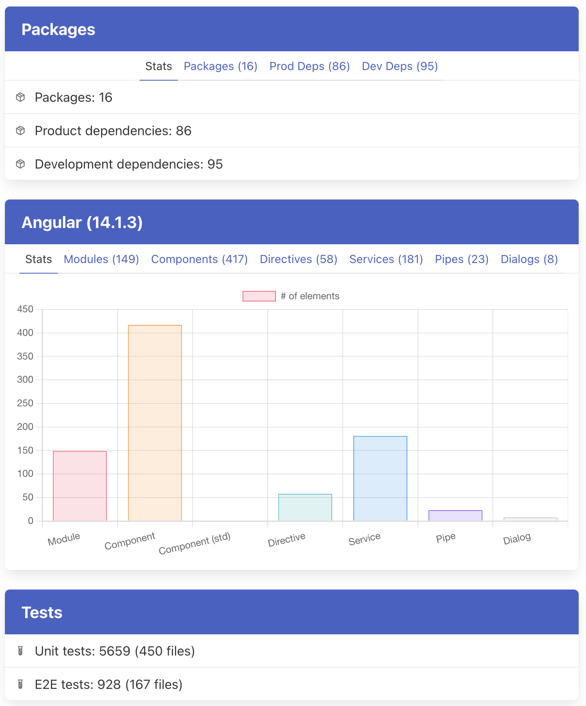

# BirdView

Command-line utilities to gather statistics for the Angular projects.

## Installing

Install Rust and Cargo  
https://doc.rust-lang.org/cargo/getting-started/installation.html

```shell
# with Cargo
cargo install birdview

# and then
birdview --help
```

## Basic Usage

```shell
cd <path-to-project>
birdview inspect . --all
```

Gives an output similar to the following:

```text
Packages
 ├── Files: 32
 ├── Dependencies: 145
 └── Dev dependencies: 104
Unit Tests
 ├── Cases: 5635
 └── Files: 452
E2E Tests
 ├── Cases: 928
 └── Files: 168
Angular
 ├── Module: 149
 ├── Component: 415
 ├── Directive: 58
 ├── Service: 181
 ├── Pipe: 23
 └── Dialog: 8
Project Files
 ├── HTML: 379
 ├── SCSS: 536
 ├── CSS: 33
 ├── TypeScript: 5125
 ├── JavaScript: 301
 ├── JSON: 548
 └── Markdown: 497
Inspection complete
```

## Code Inspection

```shell
birdview inspect --help
```

### Available Inspectors

- `package.json` files (`--packages`)
- unit and e2e tests (`--tests`)
- angular elements (`--angular`)
- markdown files (`--markdown`)

### Examples:

```shell
# run all available inspections
birdview inspect --all <project>

# inspect tests
birdview inspect --tests <project>

# inspect packages
birdview inspect --packages <project>

# inspect tests and packages
birdview inspect --tests --packages <project>
```

### Generating Reports

```shell
birdview inspect <project> --all --output <path>
```

You can generate reports using multiple templates, based on the output extension:

- `.html`: single-page HTML report
- `.json`: raw JSON report

#### HTML Report

```shell
# generate report as output.html
birdview inspect <project> --all --output output.html

# generate report as output.html and open with the default browser
birdview inspect <project> --all --output output.html --open
```

Provides an output that is similar to the following one:



#### JSON Report

```shell
birdview inspect <project> --all --output output.json
```

The format of the output is similar to the following example:

```json
{
  "project_name": "<package.json>/name",
  "project_version": "<package.json>/version",
  "report_date": "<date/time UTC>",

  "stats": {
    "package": 32,
    "package_deps": 145,
    "package_dev_deps": 104,
    
    "unit_test": 452,
    "unit_test_case": 5635,
    
    "e2e_test": 168,
    "e2e_test_case": 928,
    
    "angular_module": 149,
    "angular_component": 415,
    "angular_directive": 58,
    "angular_service": 181,
    "angular_pipe": 23,
    "angular_dialog": 8,
    
    "types_html": 379,
    "types_scss": 536,
    "types_css": 33,
    "types_ts": 5125,
    "types_js": 301,
    "types_md": 497,
    "types_json": 548
  },

  "angular": {
    "components": [],
    "directives": [],
    "services": [],
    "pipes": [],
    "dialogs": []
  },
  
  "unit_tests": [
    {
      "path": "<workspace>/<path>.spec.ts",
      "cases": [
        "case name 1",
        "case name 2"
      ]
    }
  ],
  
  "e2e_tests": [
    {
      "path": "<workspace>/<path>.e2e.ts",
      "cases": [
        "case name 1",
        "case name 2"
      ]
    }
  ],
  
  "packages": [
    {
      "path": "<workspace>/<path>/package.json",
      "dependencies": [
        {
          "name": "tslib",
          "version": "^2.0.0",
          "dev": false
        },
        {
          "name": "typescript",
          "version": "4.7.4",
          "dev": true
        }
      ]
    }
  ]
}
```
